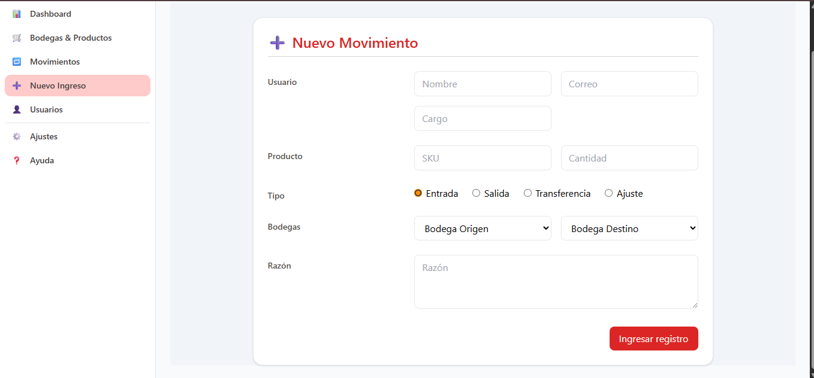

# D1 – Inventory Backoffice

Sistema de gestión de inventario con Angular + Tailwind en el frontend y Hasura GraphQL + Postgres (Docker) en el backend.
Incluye autenticación simulada en el frontend con roles (public, operator, admin) y guardas de ruta, y un modelo de datos preparado para productos, bodegas, inventario y movimientos de stock.

### Nota:
Las operaciones de CRUD ya están disponibles en el backend, pero no todas quedaron conectadas a la UI. Quedaron listas para ser invocadas desde los services del frontend o directamente vía GraphQL. Detalles abajo.

### Preview




## Estructura del repositorio

```
inventory-backoffice/
│
├── backend/                  # Base de datos, Hasura y Docker
│   ├── docker-compose.yml
│   ├── .env.example          # Variables (ejemplo, sin secretos)
│   ├── migrations/           # (opcional) SQL/Hasura (vacío en esta entrega)
│   └── metadata/             # (opcional) metadata Hasura (vacío en esta entrega)
│
├── frontend/
│   └── inventory-app/        # Angular + Tailwind
│       ├── angular.json
│       ├── src/
│       │   ├── app/
│       │   │   ├── components/confirm-modal
│       │   │   ├── pages/ (dashboard, login, shell, movimientos, usuarios, etc.)
│       │   │   └── services/ (auth, role.guard, products, warehouses, inventory, movements, users)
│       │   └── assets/ (logos / imágenes)
│       └── tailwind.config.js, postcss.config.js, ...
│
├── docs/
│   ├── MER.png               # Diagrama entidad-relación
│   └── notes.md              # Apuntes del reto
│
└── README.md                 # Este archivo

```

## ✅ Funcionalidad (estado actual)

### Roles y permisos (frontend)

### public:

- Puede ver Productos (catálogo) y Bodegas.

- No ve Movimientos, Nuevo Ingreso, ni Usuarios (UI + guards).

### operator:

- Puede ver Productos, Bodegas e Inventario (en inventario puede escribir y leer).

- Puede crear Movimientos (Ingresos/Salidas/Transferencias/Ajustes).

- No puede gestionar Usuarios.

### admin:

- Acceso completo en Productos, Bodegas, Inventario y Movimientos.

- CRUD de Usuarios (únicamente admin).

- CRUDs

### Entidades

- Productos: list, create, update, deactivate (soft delete), delete → conectado a Hasura desde ProductsService.

- Bodegas: list, create, update, deactivate, delete → conectado desde WarehousesService.

- Inventario:

	* Lectura conectada (join a product/warehouse).

	* Acciones directas (create/update/delete) desaconsejadas en UI; modal de confirmación presente.

	* Regla recomendada: cambios de inventario se realizan por movimientos (ver trigger).

- Movimientos:

	* UI lista (listado, KPIs, modal confirm).

	* MovementsService preparado con GraphQL (create/update/delete).

	* Trigger SQL (backend) actualiza inventario automáticamente tras cada movimiento.

- Usuarios:
	* Página y modal de creación listos a nivel UI; pendiente conectar mutaciones finales en UsersService (admin-only).


### 🔐 Reglas de negocio clave

- El inventario se actualiza por trigger tras cada inserción/actualización de movimientos de stock.

	* INBOUND → suma en el destino

	* OUTBOUND → resta del origen

	* TRANSFER → resta del origen y suma al destino

	* ADJUSTMENT → suma/resta según el signo de la cantidad

	* Evitar editar/eliminar inventario directamente. La UI te advierte con modal.

	* “Eliminar” preferiblemente como desactivar (active=false) para conservar trazabilidad.

## 🛠️ Requisitos

- Docker y Docker Compose

- (Opcional) Hasura CLI si vas a exportar/importar metadata


### 🔑 Autenticación (mock) y roles

La autenticación es simulada (sin backend auth).

- Ver src/app/services/auth.service.ts. Allí están los usuarios semilla (email/role/password) y el manejo de localStorage.

Guards:

- authGuard: exige sesión iniciada.

- roleGuard: restringe rutas por route.data.roles (admin/operator/public).

Rutas protegidas (src/app/app.routes.ts):

- /app/bodegas-productos → accesible a todos, pero public solo ve lo permitido por permisos de Hasura.

- /app/movimientos y /app/nuevo-ingreso → operator y admin.

- /app/usuarios → solo admin.

### 🧩 Frontend – vistas y servicios

- Shell + sidebar con visibilidad condicional por rol (no se muestran enlaces que no corresponden).

- Bodegas & Productos

- Tab “Bodegas” y “Productos”: listado conectado a Hasura.

- Acciones admin: crear, editar, desactivar, eliminar (con modal de confirmación).

- Tab “Inventario”: lectura conectada. Acciones directas desaconsejadas (modal).


## 🧩 Levantar el backend (Hasura + PostgreSQL)

Este proyecto usa Hasura + PostgreSQL en Docker. Incluye la metadata y un archivo init.sql para crear las tablas necesarias automáticamente.

### ⚙️ Requisitos previos

Tener Docker y Docker Compose instalados

### 🚀 Pasos para levantar el backend

```bash
# 1. Clona el repositorio
git clone https://github.com/usuario/stock-control-system.git
cd stock-control-system/backend

# 2. Crea el archivo de variables de entorno
cp .env.example .env
# (Rellena las variables si es necesario)

# 3. Levanta los servicios
docker compose up -d
```

Esto levantará:

- PostgreSQL en el puerto que definas en .env

- Hasura en http://localhost:8081
 (o el puerto que hayas puesto)

### 📦 ¿Qué incluye este backend?

- metadata/ → configuración de Hasura exportada

- migrations/init.sql → script SQL que crea las tablas: products, inventory, stock_movements, users, warehouses

- docker-compose.yml → configura todo para que funcione automáticamente

### ⚠️ Notas importantes

El archivo init.sql solo se ejecuta automáticamente la primera vez que levantas la base de datos. Si ya tienes datos, no se borra nada.

Si necesitas reiniciar desde cero, puedes correr:

```bash
docker compose down -v
docker compose up -d
```

## 🌐 Levantar el frontend (Angular + Apollo + Tailwind)

Este proyecto usa Angular para el frontend, junto con Apollo Client para consumir la API de Hasura y TailwindCSS para los estilos.

### ⚙️ Requisitos

Para ejecutar el frontend necesitas tener instalados:

- Node.js (versión 14 o superior)

- npm (viene con Node.js)

- Angular CLI: Puedes instalar Angular CLI globalmente con el siguiente comando:

 ```bash
 npm install -g @angular/cli
 ```

### 🚀 Pasos para ejecutar el frontend

```bash
# 1. Ir a la carpeta del frontend
cd stock-control-system/frontend

# 2. Instalar las dependencias
npm install

# 3. Correr el servidor de desarrollo
npm start
```

Esto abrirá tu frontend en http://localhost:4200

### ⚠️ Notas

El frontend se conecta automáticamente a Hasura usando Apollo Client

Asegúrate de que el backend esté corriendo primero (Hasura debe estar activo)


